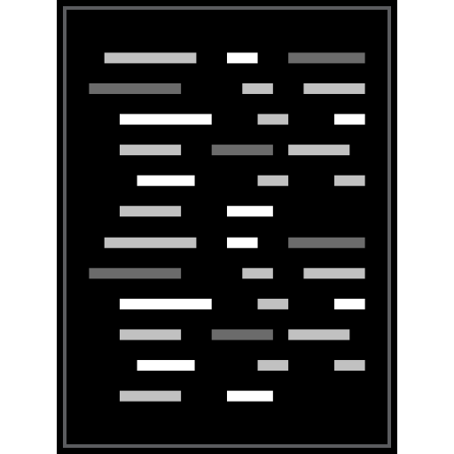

#   Ejercicios

<b>Estos son algunos de los lenguajes de programación, frameworks y herramientas en los que he llegado a realizar codificación durante mi formación universitaria y de manera autodidacta tomando cursos.</b>

<b>Hay ejercicios de programación **estructurada, orientada a objetos y funcional**.</b>
<b>Pequeños proyectos y ejercicios de lógica de programación.</b>

    
    
    
    
    
    
    
    
    
    
    
    
    
    
    
    
    
    
    
    
    
    
    

